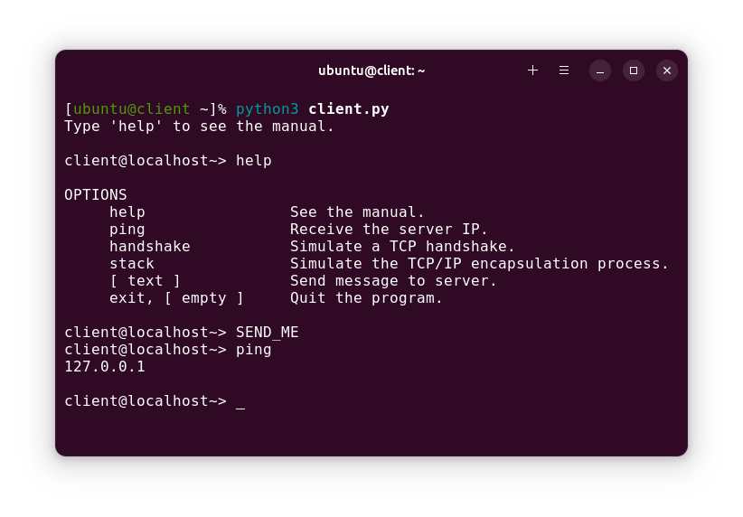
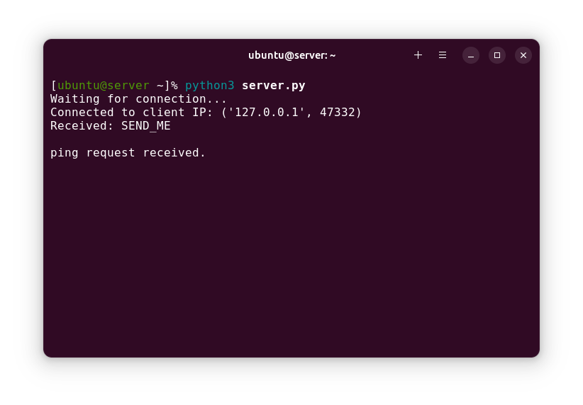

<div align="center">

# TCP/IP Stack Demonstration
### An Object-Oriented Pyhton demonstration of how the TCP/IP Stack functions

[](https://python.org/)

##
[Intro](#introduction) • [Run it](#how-to-run-it) • [Use it](#how-to-use-it)

[](#client)
[](#server)

</div>

### Introduction
This is a client / server practical demonstration of the functionality of the TCP / IP Stack written in Python. The project aims to demonstrate in a visual manner the encapsulation process of packets thoughout the stack. Some the project's functions can also be individually invoked from the Client application.

This project was made for a presentation about the TCP / IP Stack during college.

### How to Run it
To run the application, first run the server, then on a different terminal the client applications, in the following manner:
###### Server Terminal:
```sh
cd Stack
python3 server.py
```
###### Client Terminal:
```sh
cd Stack
python3 client.py
```
If examining the Server application is not necessary, it can also be run on the background, facilitating execution
###### Client & Server (single terminal):
```sh
cd Stack
python3 server.py &
python3 client.py
```
> ###### Dependencies:
> This project depends on `python3` and the following python libraries: `socket` `pickle`

### How to Use it
Once the client & server applications have connected, input your commands on the client application. The main function is the `stack` command, which simulates visually the encapsulation process of the TCP / IP Stack, while the `handshake` command simulates visually the TCP handshake process.

The `help` command prints all available commands on the terminal screen. A single message can also be sent to the server application via sockets by simply typing it and pressing enter.

<div align="center">
  
  
  
  
</div>

### Manual / Documentation

## Client

<details>
<summary> Click to read </summary>
  
#### Name
Client - An object oriented Client application that sends messages to the Server application.

#### Description
Client is an object oriented Client application written in Python that sends messages to the Server application. The Client can send regular messages or commands.

Said commands can be a Ping, which asks for the Server application IP address; a Handshake, which utilizes messages to simulate / demonstrate the TCP Three-Way Handshake process; or Stack which simulates the TCP/IP Stack encapsulation and sending process.

The Client also processes a Help command, which informs the user of the available commands and an Exit command, which closes both the Client and the Server application sockets and exits both processes.

#### Commands

| Commands | Description |
| ----- | ----- |
| [ text ] | Send regular messages to the Server application.
| ping | Asks for the Server application IP address. |
| handshake | Use messages to simulate / demonstrate the TCP Three-Way Handshake process. |
| stack | Simulate / demonstrate the TCP/IP Stack encapsulation and sending process. |
| help | See available commands. |
| exit | Closes the Client application socket and exits the program. |

#### Object Methods
Being an object oriented program, it tries to hide all the complexity it can inside it's Class.

| Method | Description |
| ----- | ----- |
| setup() | Sets up a connection to the Server application through its configured IP and Port. |
| awaitCommand() | Instructs to await an user Input. |
| closeSocket() | Closes the application's socket connection. |
| ping() | Instructs to send the Server application a Ping request and possibly receive an answer from the Server. |
| handshake() | Sends a 'SYN' message to the server application and awaits for a 'SYN' and an 'ACK' message. Then, it sends the server an 'ACK'. |
| stack() | Coordenates and displays the process of Stacking lists and pre-determined messages and sends the result to the Server. |
| encapsulate() | Uses the Stack data structure to insert pre-determined messages and data inside a list, as a means to encapsulate them. |
| sendMsg() | Sends the Server application a previously collected message. |

[](#tcpip-stack-demonstration)

</details>

## Server

<details>
<summary> Click to read </summary>

#### Name
Server - An object oriented Server application that receives messages from the Client application.

#### Description
Server is an object oriented Server application written in Python that receives messages or commands from the Client application.

When Server receives a message, it displays said message for visual confirmation. When the Server application receives the Ping command, it sends the Client application the IP address it was configured with. When it receives a 'SYN' message, it tries to simulate a TCP Three-Way Handshake, by returning a 'SYN' and an 'ACK' message to the Client application. When it receives a list, it simulates the TCP/IP Stack decapsulation process, as if it were receiving a Frame.

When it loses connection to the Client application, the Server application exits aswell.

#### Object Methods
Being an object oriented program, it tries to hide all the complexity it can inside it's Class.

| Method | Description |
| ----- | ----- |
| setup() | Sets up a TCP/IP server, binds an address and port to the server socket and listens for incoming connections on said port. |
| awaitConnection() | Instructs to accept incoming connections. |
| awaitMessage() | Receives incoming messages through a previously established connection. |
| closeSocket() | Closes the application's socket connection. |
| ping() | Sends the Client application the configured IP address. |
| handshake() | Sends the Client application a 'SYN' and an 'ACK' message. |
| stack() | Coordenates and displays the process of removing elements from a list. |
| decapsulate() | Removes the last added item on a list and returns said list. |
| printMsg() | Displays the received message as output. |

[](#tcpip-stack-demonstration)

</details>
